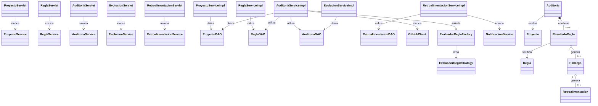

# Especificación Técnica y Arquitectónica: Diagrama de Clases — Incremento 2
### Sistema OwlAudit: Auditoría Automática, Seguimiento Evolutivo y Retroalimentación Colaborativa

Este documento describe en profundidad la arquitectura, componentes, responsabilidades y relaciones del **Diagrama de Clases Unificado del Incremento 2** (`classDiagrams-inc2.puml`). El sistema consolida los 6 casos de uso del proyecto (**CU01 a CU06**), estructurados bajo una arquitectura limpia en **N-Capas** basada en el patrón arquitectónico **MVC (Modelo-Vista-Controlador)** y el patrón de diseño GoF **Strategy**.

---

## 1. Visión Global de la Arquitectura en Capas

El diagrama de clases se organiza en bloques modulares claramente diferenciados, garantizando una alta cohesión interna y un bajo acoplamiento entre capas:

```
┌─────────────────────────────────────────────────────────────────────────────┐
│ 1. CAPA WEB / SERVLETS (com.gr4.owlaudit.web)                                │
│    Punto de entrada HTTP. Controladores que reciben peticiones y despachan. │
└──────────────────────────────────────┬──────────────────────────────────────┘
                                       │ (Azul #1E40AF: invoca)
┌──────────────────────────────────────▼──────────────────────────────────────┐
│ 2. CAPA DE SERVICIOS (com.gr4.owlaudit.service)                              │
│    Orquestación y lógica de negocio pura. Contratos (Interfaces) y clases.  │
└──────────┬───────────────────────────┬───────────────────────────────┬──────┘
           │                           │                               │
           │ (Verde #047857: utiliza)  │ (Púrpura #7C3AED: solicita)   │
┌──────────▼───────────────┐ ┌─────────▼────────────────────┐ ┌────────▼──────────────┐
│ 3. CAPA DE ACCESO        │ │ 4. PATRÓN STRATEGY           │ │ 6. CAPA DTO           │
│    A DATOS (DAOs)        │ │    Y CLIENTE API             │ │    (com.gr4.owlaudit  │
│    (com.gr4.owlaudit.dao)│ │    (com.gr4.owlaudit.reglas  │ │    .dto)              │
│    Persistencia CRUD     │ │    .strategy / .client)      │ │    Estructuras de     │
│    y consultas avanzadas │ │    Inspección técnica        │ │    transferencia      │
└──────────┬───────────────┘ └──────────────────────────────┘ │    desacopladas       │
           │                                                  └───────────────────────┘
           │ (Manipula / Retorna)
┌──────────▼──────────────────────────────────────────────────────────────────┐
│ 5. CAPA DE DOMINIO / MODELO (com.gr4.owlaudit.model)                         │
│    Entidades de negocio persistentes, agregaciones, composiciones y enums.  │
└─────────────────────────────────────────────────────────────────────────────┘
```

---

## 2. Descripción Detallada por Bloques y Clases

---

### Bloque 1: Capa Web / Servlets (`com.gr4.owlaudit.web`)

**Propósito general del bloque:**  
Actúa como la capa **Controlador** en el patrón MVC. Los servlets son los únicos componentes que interactúan con el protocolo HTTP (a través de `HttpServletRequest` y `HttpServletResponse`). Su función es recibir la petición del usuario, extraer y sanitizar los parámetros de la solicitud, delegar la ejecución a la capa de servicios y finalmente enrutar la respuesta mediante *forward* hacia la vista JSP correspondiente.

#### Clases del bloque:
1. **`ProyectoServlet`**
   * **Responsabilidad:** Gestiona el registro inicial de proyectos de software académico presentados por los estudiantes (**CU02**).
   * **Métodos principales:**
     * `# doGet()`: Presenta el formulario de inscripción del repositorio.
     * `# doPost()`: Extrae el nombre del proyecto y la URL de GitHub, valida y despacha la orden a `ProyectoService`.
2. **`ReglaServlet`**
   * **Responsabilidad:** Administra el catálogo de reglas técnicas que configuran los docentes para las auditorías (**CU01**).
   * **Métodos principales:**
     * `# doGet()`: Despliega la pantalla de parametrización de nuevas reglas.
     * `# doPost()`: Captura tipo de motor, severidad, ponderación y patrón regex o ruta, delegando su registro a `ReglaService`.
3. **`AuditoriaServlet`**
   * **Responsabilidad:** Conduce el flujo de ejecución de auditorías de calidad sobre repositorios (**CU03**).
   * **Métodos principales:**
     * `# doGet()`: Solicita la preparación previa de la auditoría (cálculo de puntaje máximo posible según reglas activas) para confirmación del usuario.
     * `# doPost()`: Ejecuta la auditoría en tiempo real y reenvía a la vista con el puntaje y hallazgos obtenidos.
4. **`EvolucionServlet`** *(Incorporado en Inc 2)*
   * **Responsabilidad:** Administra la consulta y comparación temporal de calidad entre dos auditorías de un mismo proyecto (**CU04**).
   * **Métodos principales:**
     * `# doGet()`: Lee el `proyectoId`, consulta el historial cronológico mediante `EvolucionService` y presenta la lista al usuario.
     * `# doPost()`: Recibe los identificadores `auditoriaIdA` y `auditoriaIdB`, invoca la comparación analítica y despacha los resultados a `resultadoEvolucion.jsp`.
5. **`RetroalimentacionServlet`** *(Incorporado en Inc 2)*
   * **Responsabilidad:** Controlador dual para la interacción colaborativa entre estudiante y docente sobre observaciones técnicas (**CU05** y **CU06**).
   * **Métodos principales:**
     * `# doGet()`: Despliega al docente la bandeja de solicitudes de retroalimentación con estado `PENDIENTE`.
     * `# doPost()`: 
       * Si lo invoca el **Estudiante (CU05)**: procesa el registro de una duda o justificación sobre un hallazgo específico.
       * Si lo invoca el **Docente (CU06)**: procesa la respuesta técnica y marca la solicitud como `ATENDIDA`.

---

### Bloque 2: Capa de Servicios (`com.gr4.owlaudit.service`)

**Propósito general del bloque:**  
Contiene el corazón de la aplicación: las reglas de negocio, validaciones semánticas, cálculos matemáticos y la orquestación entre repositorios y clientes externos. Para asegurar el principio de inversión de dependencias (**DIP**) y permitir pruebas unitarias aisladas, cada servicio se define mediante una **Interfaz (contrato)** y su respectiva **Clase Implementadora (`ServiceImpl`)**.

#### Clases e Interfaces del bloque:
1. **`ProyectoService` / `ProyectoServiceImpl`**
   * **Responsabilidad:** Aplica validaciones sobre los proyectos de software (**CU02**).
   * **Operaciones clave:**
     * `validarEnlace()`: Verifica que el enlace proporcionado corresponda a una URL válida y con sintaxis adecuada de GitHub.
     * `registrarProyecto()`: Construye y persiste la entidad `Proyecto` a través de `ProyectoDAO`.
2. **`ReglaService` / `ReglaServiceImpl`**
   * **Responsabilidad:** Gobierna la consistencia técnica de las reglas evaluadoras (**CU01**).
   * **Operaciones clave:**
     * `validarSintaxisYFormato()`: Valida que los parámetros exactos (rutas, extensiones, nombres de carpetas) no estén vacíos ni posean caracteres ilegales.
     * `registrarReglaEvaluacionTecnica()`: Verifica que no exista una regla previa con el mismo nombre y ordena su guardado.
3. **`AuditoriaService` / `AuditoriaServiceImpl`**
   * **Responsabilidad:** Coordinador maestro de la inspección técnica (**CU03**).
   * **Operaciones clave:**
     * `prepararAuditoria()`: Suma las ponderaciones de todas las reglas activas para establecer el puntaje base ideal.
     * `ejecutarAuditoria()`: Invoca al cliente de GitHub para descargar el árbol de rutas del repositorio, solicita las estrategias evaluadoras a la factoría, evalúa el cumplimiento regla por regla, cuantifica el puntaje y registra la auditoría con sus hallazgos en cascada.
4. **`EvolucionService` / `EvolucionServiceImpl`** *(Incorporado en Inc 2)*
   * **Responsabilidad:** Lógica analítica y cálculo comparativo de calidad en memoria (**CU04**).
   * **Operaciones clave:**
     * `listarHistorial(proyectoId)`: Recupera las auditorías del proyecto transformándolas en resúmenes listos para la interfaz.
     * `compararAuditorias(idA, idB)`: Carga las auditorías completas con sus resultados, determina cuál es la base (más antigua) y cuál la comparada (más reciente), computa la variación numérica (`puntajeComparada - puntajeBase`) y porcentual, y clasifica los hallazgos en `NUEVO`, `PERSISTENTE` o `CORREGIDO`.
5. **`RetroalimentacionService` / `RetroalimentacionServiceImpl`** *(Incorporado en Inc 2)*
   * **Responsabilidad:** Supervisa el ciclo de vida de las dudas y orientaciones técnicas (**CU05** y **CU06**).
   * **Operaciones clave:**
     * `solicitarRevision()`: Verifica que el hallazgo no se encuentre ya en proceso de revisión y genera la solicitud en estado `PENDIENTE`.
     * `atenderRetroalimentacion()`: Valida la longitud y pertinencia de la respuesta técnica (mínimo 10 caracteres), actualiza el estado a `ATENDIDA`, marca la fecha/hora de atención y detona la notificación al alumno.
6. **`NotificacionService` / `NotificacionServiceImpl`** *(Incorporado en Inc 2)*
   * **Responsabilidad:** Desacopla la infraestructura de mensajería para alertar al estudiante cuando su solicitud de retroalimentación ha sido atendida por el cuerpo docente (**CU06**).

---

### Bloque 3: Capa de Acceso a Datos (`com.gr4.owlaudit.dao`)

**Propósito general del bloque:**  
Aísla las operaciones de persistencia en base de datos bajo el patrón **Data Access Object (DAO)**. Desacopla a los servicios de los detalles de SQL, transacciones o mapeos relacionales (ORM).

#### Clases e Interfaces del bloque:
1. **`ProyectoDAO` / `ProyectoDAOImpl`**
   * **Responsabilidad:** Operaciones CRUD sobre la tabla de proyectos (`guardar`, `buscarPorId`).
2. **`ReglaDAO` / `ReglaDAOImpl`**
   * **Responsabilidad:** Gestión de persistencia de reglas técnicas. Incluye `existePorNombre()` (control de unicidad) y `listarActivas()` (recuperación de reglas habilitadas para evaluar).
3. **`AuditoriaDAO` / `AuditoriaDAOImpl`**
   * **Responsabilidad:** Persistencia del historial de auditorías y sus grafos complejos de resultados.
   * **Método clave ampliado en Inc 2:**
     * `buscarConResultados(id : Long) : Auditoria`: Ejecuta una carga ansiosa (Eager fetch) que recupera la cabecera de la auditoría conjuntamente con su colección de `ResultadoRegla`, las `Regla` asociadas y los `Hallazgo` generados. Esto es imprescindible para que `EvolucionService` opere en memoria sin múltiples accesos lentos a la base de datos.
4. **`RetroalimentacionDAO` / `RetroalimentacionDAOImpl`** *(Incorporado en Inc 2)*
   * **Responsabilidad:** Persistencia y consulta de las revisiones docentes (`guardar`, `buscarPorId`, `buscarPorHallazgoId`, `actualizar`).

---

### Bloque 4: Subsistema de Evaluación con Patrón Strategy (`com.gr4.owlaudit.reglas.strategy`) y Cliente Externo (`client`)

**Propósito general del bloque:**  
Permite que OwlAudit evalúe diferentes tipos de reglas arquitectónicas de forma modular y extensible sin modificar el código de auditoría cada vez que surge un nuevo criterio de calidad (Principio Abierto/Cerrado - **OCP**).

#### Clases del bloque:
1. **`EvaluadorReglaStrategy` (Interfaz Strategy):** Define el contrato uniforme `evaluar() : boolean`.
2. **`EvaluadorPresenciaArchivo`:** Estrategia concreta que comprueba la existencia de archivos obligatorios en el repositorio (ej. `README.md`, `.gitignore`, `pom.xml`).
3. **`EvaluadorRestriccionArchivos`:** Estrategia concreta que valida la ausencia de ficheros prohibidos o no deseados (ej. binarios `.class`, ejecutables `.exe`, credenciales `.env`).
4. **`EvaluadorEstructuraCarpetas`:** Estrategia concreta que valida la jerarquía estandarizada del proyecto (ej. `src/main/java`, `docs/`).
5. **`EvaluadorReglaFactory`:** Factoría encargada de instanciar la estrategia concreta correcta con base en el enum `TipoMotorEnum` de la regla.
6. **`GitHubClient` (`com.gr4.owlaudit.client`):** Cliente de integración que consume la API REST de GitHub (endpoints `/repos/{owner}/{repo}` y `/git/trees/{sha}?recursive=1`) para mapear el árbol de directorios del proyecto en una lista de rutas procesables en memoria.

---

### Bloque 5: Capa de Dominio / Modelo (`com.gr4.owlaudit.model`)

**Propósito general del bloque:**  
Representa las entidades del negocio, sus identidades, ciclos de vida y relaciones estructurales fundamentales. Son las clases persistentes mapeadas a la base de datos.

#### Clases y Enumeraciones del bloque:
1. **`Proyecto`:** Representa el software académico evaluado (`id`, `nombre`, `urlGithub`, `estudianteId`, `fechaRegistro`).
2. **`Regla`:** Especificación técnica de evaluación creada por el docente (`tipoMotor`, `nombreRepresentativo`, `descripcionDetallada`, `parametroExacto`, `nivelSeveridad`, `ponderacion`, `activa`).
3. **`Auditoria`:** Registro inmutable de una sesión de evaluación ejecutada en una marca de tiempo dada (`fechaHora`, `usuarioId`, `puntajeObtenido`, `puntajeMaximo`, `porcentaje`). Actúa como raíz de agregación de los resultados.
4. **`ResultadoRegla`:** Evaluación individual de una regla dentro de una auditoría concreta (`cumple`, `puntosObtenidos`). Si la regla se incumple, referencia opcionalmente a un hallazgo.
5. **`Hallazgo`:** Detalle técnico de una no conformidad (`nivelSeveridad`, `evidencia`, `recomendacion`).
   * *Extensión en Inc 2:* Contiene la referencia hacia `Retroalimentacion` para conocer si el estudiante ya abrió una consulta técnica sobre esta observación.
6. **`Retroalimentacion`** *(Incorporado en Inc 2):* Entidad unificada que modela el ciclo colaborativo completo:
   * Nace en **CU05** con la justificación del alumno, fecha de solicitud y estado inicial `PENDIENTE`.
   * Se actualiza en **CU06** con la respuesta técnica del docente, marca temporal de resolución y cambio de estado a `ATENDIDA`.
7. **Enumeraciones del Dominio:**
   * **`TipoMotorEnum`:** `PRESENCIA_ARCHIVO`, `RESTRICCION_ARCHIVOS`, `ESTRUCTURA_CARPETAS`.
   * **`NivelSeveridadEnum`:** `ALTA`, `MEDIA`, `BAJA`.
   * **`EstadoRetroEnum`:** `PENDIENTE`, `ATENDIDA`.
   * **`EstadoEvolucionEnum`:** `NUEVO`, `PERSISTENTE`, `CORREGIDO` (utilizado en memoria para tipificar el cambio de hallazgos entre auditorías en CU04).

---

### Bloque 6: Capa de Transferencia de Datos (`com.gr4.owlaudit.dto`)

**Propósito general del bloque:**  
Agrupa objetos planos (POJOs) sin lógica de negocio diseñados exclusivamente para transportar información entre los controladores web y los servicios. Su presencia evita exponer directamente las entidades del modelo a la vista o recibir parámetros dispersos.

* **`NuevoProyectoDTO`**: Parámetros de registro de proyecto (CU02).
* **`NuevaReglaDTO`**: Parámetros de configuración de regla (CU01).
* **`ResumenAuditoriaDTO`**: Vista previa de puntajes ideales antes de confirmar (CU03).
* **`ResultadoAuditoriaDTO`**: Resumen del puntaje final y porcentaje de auditoría (CU03).
* **`AuditoriaResumenDTO`**: Datos compactos de auditorías para poblar listas y tablas históricas (CU04).
* **`EvolucionDTO`**: Contenedor final de la comparación evolutiva (variación numérica, porcentual y balance de hallazgos) (CU04).
* **`SolicitudRetroalimentacionDTO`**: DTO con el `hallazgoId` y la `justificacion` redactada por el alumno (CU05).
* **`AtenderRetroalimentacionDTO`**: DTO con el `idRetroalimentacion` y la `respuestaTecnica` redactada por el docente (CU06).

---

## 3. Relaciones entre Componentes y su Justificación

En el diagrama `classDiagrams-inc2.puml`, las conexiones han sido codificadas por colores para eliminar cualquier ambigüedad visual:



### 3.1 Relaciones Web $\rightarrow$ Servicios (Líneas Azules `#1E40AF`)
* **`Servlet -down-> Service : invoca`**
  * **Tipo:** Asociación dirigida / Dependencia.
  * **Por qué:** Cada Servlet conoce exclusivamente a la interfaz del Servicio que atiende su caso de uso. Esto garantiza el principio MVC: la interfaz web no contiene lógica de negocio ni interactúa con la base de datos directamente.

### 3.2 Relaciones Servicios $\rightarrow$ DAOs (Líneas Verdes `#047857`)
* **`ServiceImpl -down-> DAO : utiliza`**
  * **Tipo:** Asociación dirigida de uso.
  * **Por qué:** Los servicios orquestan la persistencia delegando las operaciones atómicas a sus respectivos DAOs.
  * *Punto clave de simplificación:* `EvolucionServiceImpl` se conecta **únicamente a `AuditoriaDAO`** porque este DAO ya posee `listarPorProyecto(proyectoId)` y `buscarConResultados()`. No requiere enlazarse con `ProyectoDAO`, evitando cruces de líneas innecesarios.

### 3.3 Relaciones Servicios $\rightarrow$ Auxiliares (Líneas Púrpuras `#7C3AED`)
* **`AuditoriaServiceImpl -right-> GitHubClient` & `EvaluadorReglaFactory`**
  * **Por qué:** La auditoría requiere consultar la infraestructura externa de repositorios y construir dinámicamente las estrategias de inspección.
* **`RetroalimentacionServiceImpl -right-> NotificacionService`**
  * **Por qué:** Al culminar la atención técnica en CU06, se despacha un mensaje al alumno sin atar el servicio a una tecnología de correo o mensajería particular.

### 3.4 Relaciones del Modelo de Dominio
* **`Auditoria --> Proyecto : evalua`**
  * **Tipo:** Asociación simple. Una auditoría pertenece a un proyecto evaluado.
* **`Auditoria "1" *-- "many" ResultadoRegla : contiene`**
  * **Tipo:** **Composición fuerte** (Línea roja `#DC2626`).
  * **Por qué:** Un `ResultadoRegla` no tiene sentido de existir de forma independiente fuera de una `Auditoria`. Si se elimina la auditoría, se destruyen todos sus resultados asociados en cascada.
* **`ResultadoRegla --> Regla : verifica`**
  * **Tipo:** Asociación dirigida. Cada resultado sabe qué regla técnica fue la contrastada.
* **`ResultadoRegla "1" o-- "0..1" Hallazgo : genera`**
  * **Tipo:** **Agregación débil** (Línea naranja `#D97706`).
  * **Por qué:** Solo los incumplimientos (`cumple == false`) dan origen a un hallazgo. Si la regla se cumple, la relación es nula (`0`).
* **`Hallazgo "1" o-- "0..1" Retroalimentacion : genera`**
  * **Tipo:** **Agregación débil** (Línea naranja `#EA580C`).
  * **Por qué:** Un hallazgo puede o no recibir una solicitud de revisión por parte del estudiante (`0..1`). La regla de negocio de CU05 impide duplicar retroalimentaciones sobre un mismo hallazgo; por ello, la multiplicidad máxima es estrictamente `1`.

---

## 4. Trazabilidad con los Casos de Uso del Proyecto

| Caso de Uso | Servlet Participante | Servicio Involucrado | DAOs y Componentes Clave | Entidades Manipuladas |
| :--- | :--- | :--- | :--- | :--- |
| **CU01: Registrar Regla Técnica** | `ReglaServlet` | `ReglaService` | `ReglaDAO` | `Regla`, `TipoMotorEnum`, `NivelSeveridadEnum` |
| **CU02: Registrar Proyecto** | `ProyectoServlet` | `ProyectoService` | `ProyectoDAO` | `Proyecto` |
| **CU03: Ejecutar Auditoría** | `AuditoriaServlet` | `AuditoriaService` | `ProyectoDAO`, `ReglaDAO`, `AuditoriaDAO`, `GitHubClient`, `EvaluadorReglaFactory` | `Auditoria`, `ResultadoRegla`, `Hallazgo` |
| **CU04: Consultar Evolución** | `EvolucionServlet` | `EvolucionService` | `AuditoriaDAO` (`buscarConResultados`) | `Auditoria`, `ResultadoRegla`, `EstadoEvolucionEnum` *(en memoria)* |
| **CU05: Solicitar Feedback** | `RetroalimentacionServlet` | `RetroalimentacionService` | `RetroalimentacionDAO` (`buscarPorHallazgoId`, `guardar`) | `Hallazgo`, `Retroalimentacion` *(estado PENDIENTE)* |
| **CU06: Atender Feedback** | `RetroalimentacionServlet` | `RetroalimentacionService` | `RetroalimentacionDAO` (`buscarPorId`, `actualizar`), `NotificacionService` | `Retroalimentacion` *(estado ATENDIDA)* |
